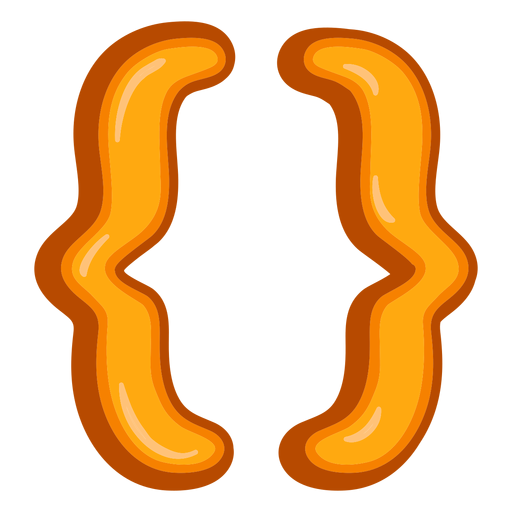

<div align="center" >

 &nbsp;


# <span>&nbsp;</span> Console Projects in RUST

This repository contains a collection of console-based projects developed in the Rust programming language. Each project demonstrates fundamental Rust concepts and provides practical examples of building command-line utilities and applications.
</div>

## How to Run

```sh
cd ./{cargo-project} ;
cargo run ;
```

## How to Build/Package

```sh
cd ./{cargo-project} ;
cargo build ;
./target/debug/{cargo-project}
```

## Topics

- [ ] Input/Output
- [ ] File System
- [ ] Fixed Console Coordinates
- [ ] Console Colors
- [ ] Console Animations
- [ ] Database 
- [ ] Terminal Commands and Control
- [ ] Date/Time 
- [ ] API Calls and Deserialization
- [ ] Web Crawling
- [ ] Web Scraping
- [ ] Hardware Interaction
    - [ ] Beeps and Sounds
    - [ ] Microphone
- [ ] FPS and Program loop
- [ ] Password Encryption/Decryption
- [ ] Data Processing
- [ ] Visuals -> Charts/Graphs/Progress/Status etc

## Programs/Projects

- [x] TODOs Program (todo)
- [x] Tik-Tak-Toe Game Program (tik-tak-toe)
- [ ] Bill Manager Program (bill-manager)