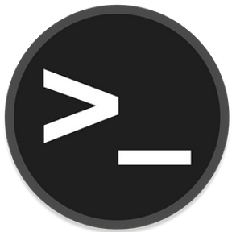
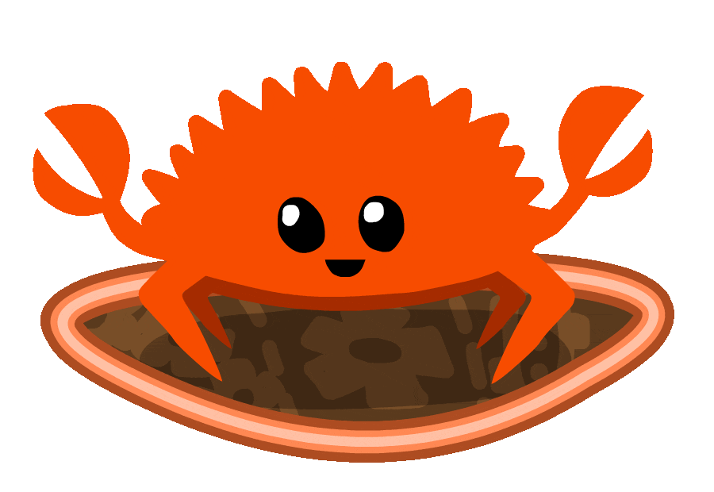

 &nbsp;

# &nbsp; Console Projects in RUST

This repository contains a collection of console-based projects developed in the Rust programming language. Each project demonstrates fundamental Rust concepts and provides practical examples of building command-line utilities and applications.

