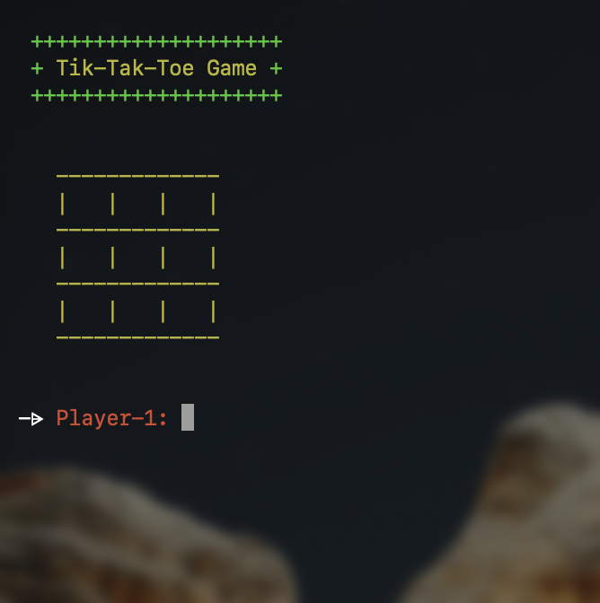
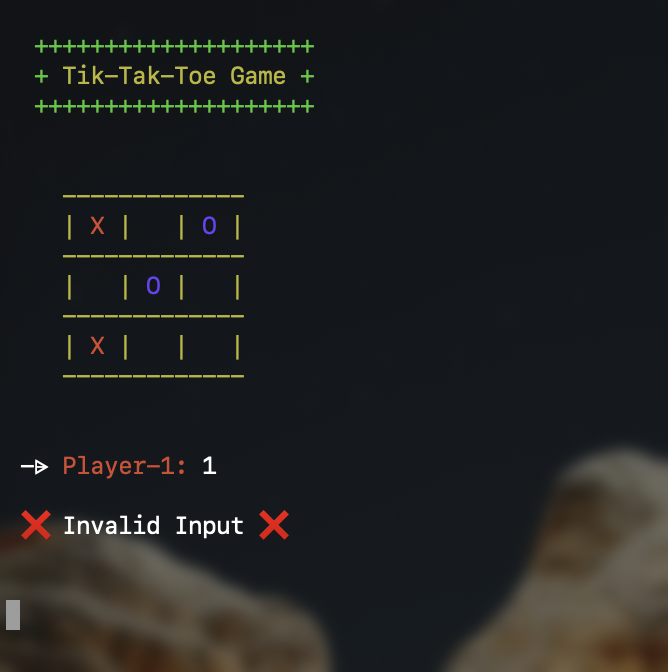
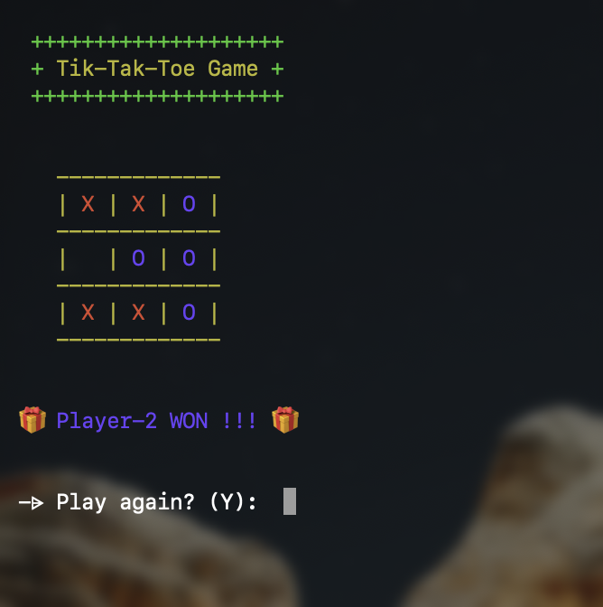
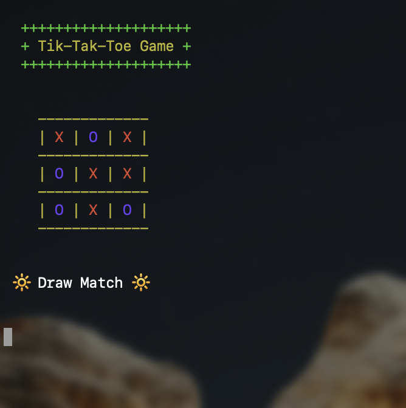
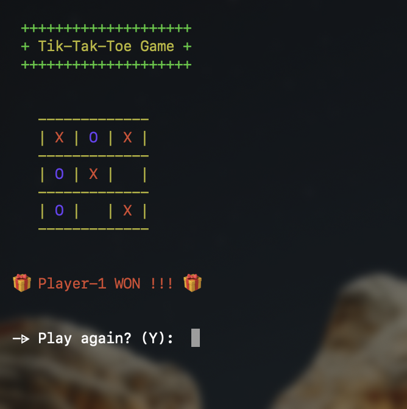

<div align="center" >
 
<br />
<h1>Tik-Tak-Toe Program</h1>

This project is a console-based implementation of the classic Tik-Tak-Toe game using Rust programming language. It provides a simple yet engaging experience where players can compete against each other on the command line.

</div>

## Features
- **Play Tik-Tak-Toe:** Enjoy a game of Tik-Tak-Toe against another player.
- **Interactive Console Interface:** User-friendly interface designed for seamless gameplay.
- **Board Display:** Visual representation of the game board during gameplay.
- **Player vs Player:** Two players can take turns marking spaces on the board.
- **Win Detection:** Automatically detects when a player achieves three symbols in a row.
- **Draw Game Detection:** Recognizes when no more moves are possible without a winner.
- **Play Again Option:** After each game, players can choose to start a new game without restarting the program.

## How to Play
- **Installation:** Clone the repository and compile using Cargo.

```sh
git clone https://github.com/ZaeemTarrar/rust-programs.git ;
cd ./rust-programs/tik-tak-toe/ ;
cargo build ;
```

- **Run:** Launch the executable to start the Tic-Tac-Toe game.

```sh
./target/debug/tik-tak-toe ;
```

- **Gameplay:** Follow on-screen prompts to input your moves and enjoy the game.
- **Play Again:** After each game, choose whether to play another round or exit.

## Snapshots

<div align="center" >
&nbsp;&nbsp;
&nbsp;&nbsp;
&nbsp;&nbsp;
&nbsp;&nbsp;
&nbsp;&nbsp;
</div>