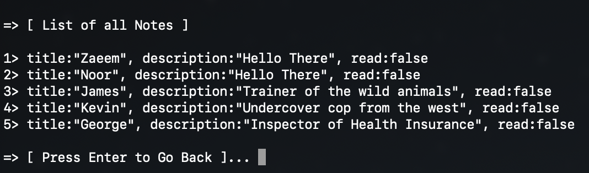
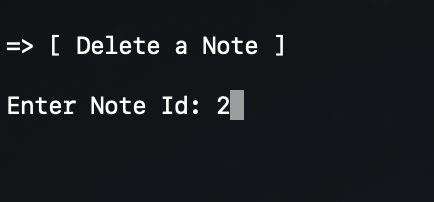
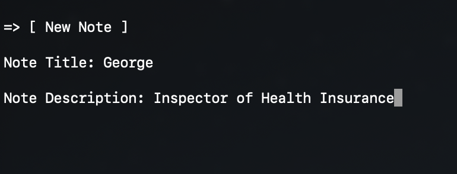

# 

 
 
<h1>TODOs Program</h1>

This project is a simple todo application implemented in Rust, designed to manage notes via a console interface. Users can create new notes, delete existing ones, and display their current list of notes directly from the command line.

## Features
- **Create Notes:** Easily add new notes to your todo list.
- **Delete Notes:** Remove notes that are completed or no longer needed.
- **Display Notes:** View your current list of notes with descriptions.
- **Change Notes Status:** Every note after it's read or seen, is marked as read.
## Glance

&nbsp;&nbsp;
&nbsp;&nbsp;
&nbsp;&nbsp;
&nbsp;&nbsp;
&nbsp;&nbsp;

